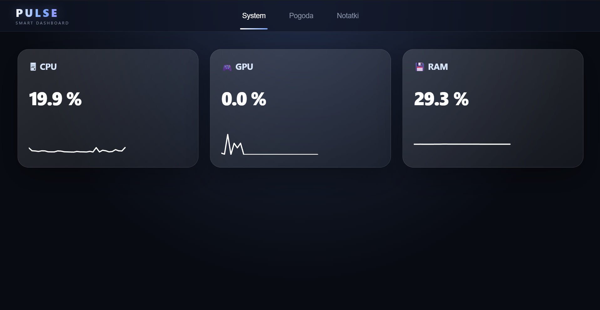
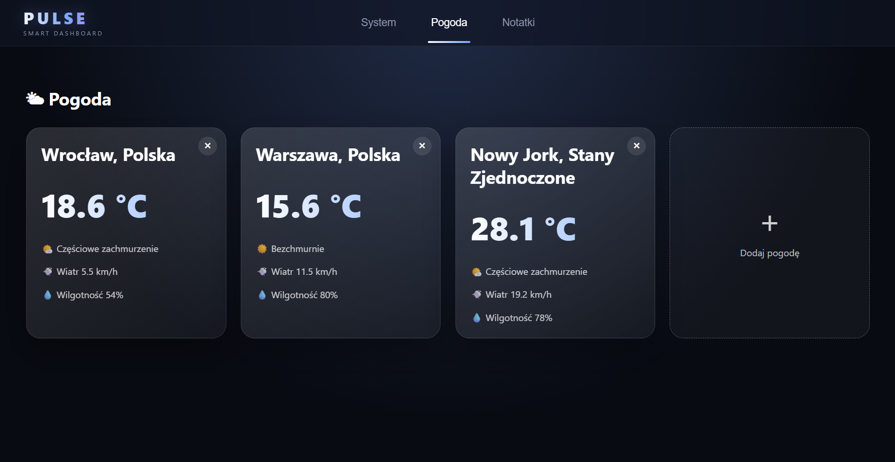
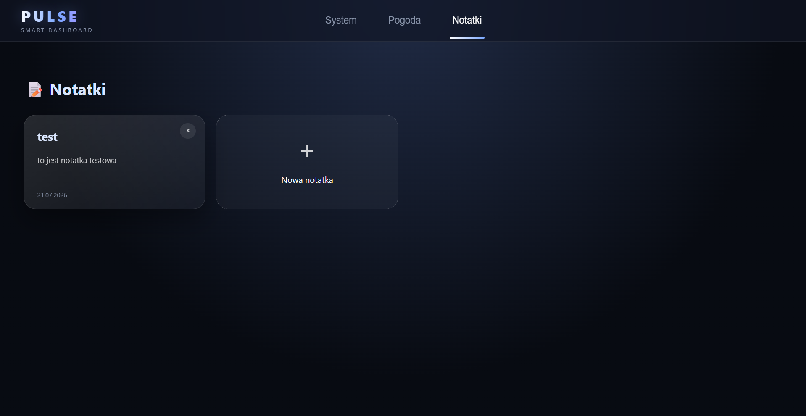

# ⚡ Pulse - Smart Dashboard



Pulse is a futuristic personal smart dashboard created from scratch.

The goal of this project is to build a customizable all-in-one workspace that combines system monitoring, weather information, notes and future productivity tools in one modern interface.

Pulse focuses on:

- modular widget architecture
- modern futuristic UI
- local data storage
- expandable features
- customizable user experience

---

# ✨ Features

## ✅ Completed

# 🖥 System Dashboard


Features:

- CPU monitoring
- GPU monitoring
- RAM monitoring
- Real-time updates
- Separate system widgets
- Clean dashboard layout

---

# 🌤 Weather Widget



Features:

- Weather search
- City selection
- Multiple saved locations
- Automatic loading after restart
- Local storage
- Weather cards
- Temperature information
- Wind speed
- Humidity
- Weather icons based on conditions

---

# 📝 Notes Widget



Features:

- Creating notes
- Removing notes
- Local saving
- Individual note cards
- Note preview
- Full note editor
- Modern glass-style interface

---

# 🚧 Currently Developing

# 📅 Calendar Widget

Planned features:

- Monthly calendar view
- Adding events
- Removing events
- Saving events locally
- Event colors
- Reminders
- Connection with notes

---

# 🚀 Future Roadmap

## Customization

Future plans:

- Drag & drop widgets
- Custom dashboard layouts
- Themes
- More UI personalization

## Storage 2.0

Improvements:

- Better local database structure
- Saving widget positions
- User settings
- Layout saving
- Application preferences

## More Widgets

Planned:

- Calendar
- To-do list
- Music player
- Network monitor
- Performance graphs
- Battery monitor
- Smart launcher

---

# 🏗 Project Structure

```
Pulse
│
├── assets
│   ├── system.png
│   ├── pogoda.png
│   └── notatki.png
│
├── src
│   │
│   ├── components
│   │   ├── weather-card
│   │   ├── note-card
│   │   └── UI components
│   │
│   ├── services
│   │   ├── weather
│   │   ├── weather-storage
│   │   └── note-storage
│   │
│   ├── widgets
│   │   ├── weather
│   │   ├── notes
│   │   ├── cpu
│   │   ├── gpu
│   │   └── ram
│   │
│   ├── storage.ts
│   ├── main.ts
│   └── style.css
│
└── README.md
```

---

# 🎨 Design

Pulse uses a futuristic glassmorphism design inspired by modern operating systems.

Design elements:

- dark interface
- blue/purple gradients
- transparent cards
- blur effects
- smooth animations
- modular widgets

---

# 📸 Screenshots

## System Dashboard


## Weather


## Notes


---

# 🎯 Project Vision

The goal of Pulse is to create a personal smart workspace where everything important is available in one beautiful and customizable application.

The idea:

> "One dashboard. Everything you need."

Pulse is not only a dashboard — it is a continuously expanding personal workspace.

---

# 🛠 Technologies

- TypeScript
- Vite
- Tauri
- HTML
- CSS
- LocalStorage

---

# 👨‍💻 Author

Created by Leon

Personal programming project focused on learning, experimentation and building a real-world application.
